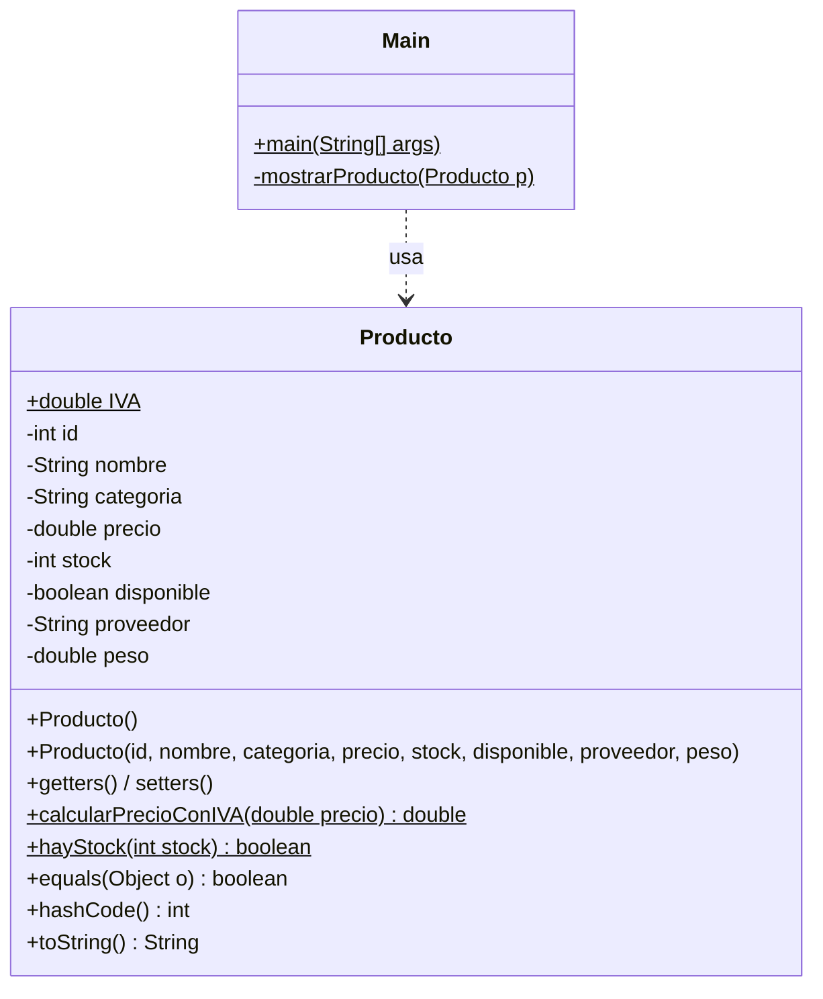

# Práctica 2 · Entornos de Desarrollo — Clase `Producto`

[](https://github.com/sanchezcontentopablo-max/practica2-EEDD/actions/workflows/ci.yml)
[](https://sanchezcontentopablo-max.github.io/practica2-EEDD/)


Modelado de una entidad `Producto` en Java aplicando los fundamentos de la
Programación Orientada a Objetos, documentación con **Javadoc** y pruebas
unitarias con **JUnit 6**. Práctica de la asignatura *Entornos de Desarrollo*
(1.º DAW).

📚 **Documentación generada:** <https://sanchezcontentopablo-max.github.io/practica2-EEDD/>

## Qué se practica

| Concepto | Dónde |
|---|---|
| Encapsulación (atributos privados + getters/setters) | [`Producto`](src/main/java/org/endes/entities/Producto.java) |
| Sobrecarga de constructores | constructor por defecto y completo |
| Validación de datos con excepciones | precio, stock y peso no negativos; nombre obligatorio |
| Métodos estáticos y constantes | `calcularPrecioConIVA`, `hayStock`, `IVA` |
| `equals`, `hashCode` y `toString` | identidad por `id` |
| Documentación Javadoc | todas las clases y métodos públicos |
| Pruebas unitarias | [`ProductoTest`](src/test/java/org/endes/entities/ProductoTest.java): 30 tests |
| Cobertura de código | JaCoCo, mínimo exigido 90 % de líneas |
| Integración continua | GitHub Actions compila, prueba y publica el Javadoc |
| Flujo de ramas GitFlow | `feature/*` → `develop` → `master` |

## Diagrama de clases



## Requisitos

- JDK 21 o superior
- Maven 3.9+ (o el Maven integrado en IntelliJ IDEA)

## Uso

```bash
# Compilar, ejecutar los tests y comprobar la cobertura
mvn verify

# Ejecutar el programa de demostración
mvn -q compile exec:java

# Generar la documentación Javadoc en target/reports/apidocs/
mvn javadoc:javadoc
```

El informe de cobertura queda en `target/site/jacoco/index.html`.

### Ejemplo de salida

```text
============================================================
    PRUEBA EXHAUSTIVA DE LA CLASE PRODUCTO
============================================================

--- PRUEBA 4: Métodos estáticos ---
Producto 1 - Precio base: 15,50€
Producto 1 - Precio con IVA (21%): 18,76€
Producto 1 - ¿Hay stock?: true

--- PRUEBA 6: Validación de datos ---
Precio negativo rechazado: El precio no puede ser negativo: -10.0
El precio se conserva: 350.0€
```

## Pruebas

Los tests están organizados con `@Nested` y `@DisplayName` para que el informe
se lea como una especificación:

```text
Producto
├── Constructores (3)
├── Getters y setters (13)          ← incluye tests parametrizados de datos inválidos
├── Métodos estáticos (10)          ← @CsvSource con casos de IVA y stock
└── equals, hashCode y toString (4)
```

## Estructura

```text
practica2-EEDD/
├── pom.xml
├── src/
│   ├── main/java/org/endes/entities/
│   │   ├── Main.java          # demostración por consola
│   │   └── Producto.java      # entidad
│   └── test/java/org/endes/entities/
│       └── ProductoTest.java  # pruebas unitarias
└── .github/workflows/
    ├── ci.yml                 # compila y prueba en cada push y PR
    └── javadoc.yml            # publica el Javadoc en GitHub Pages
```

## Flujo de trabajo

El repositorio sigue **GitFlow**: el desarrollo se hace en ramas `feature/*`,
que se integran en `develop` mediante *pull request*; `master` solo recibe
versiones estables desde `develop`.

## Autor

**Pablo Sánchez Contento** · [GitHub](https://github.com/sanchezcontentopablo-max)
